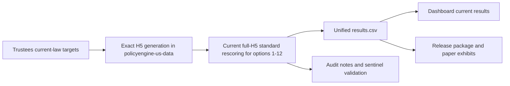

# Current CRFB Handbook

## Start Here For Reform Modeling

**Before any reform Modal launch, read
[`REFORM_MODELING_BIBLE.md`](REFORM_MODELING_BIBLE.md).** It is the controlling
source of truth for the reform-modeling relaunch and the full reform H5/R2
artifact contract. Gate progress is tracked in
[`reform-modeling-progress.json`](reform-modeling-progress.json).

This is the current documentation spine for the active CRFB trust-fund-taxation
work. For any reform-modeling relaunch, the Bible and progress ledger above
control over the rest of this handbook.

It is designed to answer four questions quickly:

1. What are we actually modeling?
2. How are the outputs produced?
3. Which artifacts are current versus legacy?
4. What do we send externally?

## What This Covers

- the standard `option1` through `option12` long-run analysis
- legacy/background documentation for the hardened exact-only static rebuild
  path; do not use it as the production full-H5 reform relaunch path
- the delivery boundary between current dashboard outputs and legacy
  spreadsheet-reference values

## Current Workflow At A Glance

The diagram below documents the current release workflow. It is not approval to
launch reform modeling. The active reform relaunch path is controlled by
[`REFORM_MODELING_BIBLE.md`](REFORM_MODELING_BIBLE.md).

## Read In This Order

- [REFORM_MODELING_BIBLE.md](REFORM_MODELING_BIBLE.md)
  - controlling plan for reform modeling, full reform H5 retention, R2
    durability, forbidden paths, and launch gates
- [methodology.md](methodology.md)
  - scope, scenario families, modeling assumptions, and interpretation rules
- [pipeline.md](pipeline.md)
  - production workflow, scripts, and validation gates
- [late-year-support-gates.md](late-year-support-gates.md)
  - publication hard stops for late-year household support and TOB contributor
    support
- [deliverables.md](deliverables.md)
  - dashboard, spreadsheet, and release checklist
- [analysis/long_run_rescoring_findings.md](../../analysis/long_run_rescoring_findings.md)
  - live run status and anomaly log

## Operating Rules

- Treat legacy stitched standard outputs as comparison artifacts only.
- Treat the deleted legacy Jupyter Book as historical context only; the current
  surfaces are the dashboard, Quarto paper, and operational docs.
- Keep prior or legacy values in comparison spreadsheets only, not in the
  dashboard current-results path.
- For reform modeling, trust the Bible and progress ledger above any run
  artifact or prose note. A run artifact can be evidence only if the ledger
  points to it and marks the related gate complete.
- Outside the reform relaunch, if a run artifact conflicts with a prose note,
  trust the artifact and update the prose.

## Where To Go Next

- Need the modeling contract:
  [methodology.md](methodology.md)
- Need the exact commands and scripts:
  [pipeline.md](pipeline.md)
- Need the shipping surface:
  [deliverables.md](deliverables.md)
- Need the latest audit status:
  [analysis/long_run_rescoring_findings.md](../../analysis/long_run_rescoring_findings.md)
