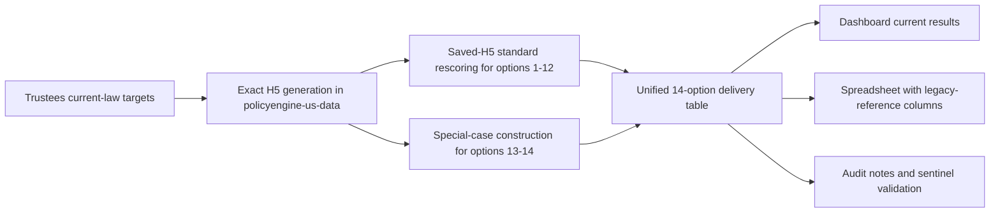

# Current CRFB Handbook

This is the current documentation spine for the active CRFB trust-fund-taxation
rerun.

It is designed to answer four questions quickly:

1. What are we actually modeling?
2. How are the outputs produced?
3. Which artifacts are current versus legacy?
4. What do we send externally?

## What This Covers

- the standard `option1` through `option12` long-run rerun
- the special-case `option13` balanced-fix series and `option14_stacked`
- the hardened exact-only static rebuild path
- the delivery boundary between current dashboard outputs and legacy
  spreadsheet-reference values

## Workflow At A Glance

## Read In This Order

- [methodology.md](methodology.md)
  - scope, scenario families, modeling assumptions, and interpretation rules
- [pipeline.md](pipeline.md)
  - production workflow, scripts, and validation gates
- [deliverables.md](deliverables.md)
  - dashboard, spreadsheet, and release checklist
- [analysis/long_run_rescoring_findings.md](../../analysis/long_run_rescoring_findings.md)
  - live run status and anomaly log

## Operating Rules

- Treat legacy stitched standard outputs as comparison artifacts only.
- Treat the archival Jupyter Book as historical narrative, not as the current
  methodology source of truth.
- Keep prior or legacy values in comparison spreadsheets only, not in the
  dashboard current-results path.
- If a run artifact conflicts with a prose note, trust the artifact and update
  the prose.

## Where To Go Next

- Need the modeling contract:
  [methodology.md](methodology.md)
- Need the exact commands and scripts:
  [pipeline.md](pipeline.md)
- Need the shipping surface:
  [deliverables.md](deliverables.md)
- Need the latest audit status:
  [analysis/long_run_rescoring_findings.md](../../analysis/long_run_rescoring_findings.md)
