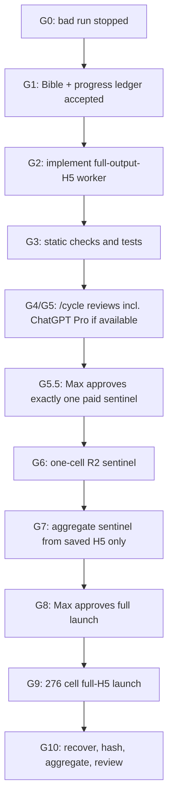

# CRFB Reform Modeling Bible

**This is the controlling document for the CRFB reform-modeling relaunch.**
If any instruction, script, heartbeat, chat summary, or older note conflicts with
this file, stop and resolve the conflict here before running paid work.

Progress is tracked in
[`reform-modeling-progress.json`](reform-modeling-progress.json). Every agent
must update that ledger after completing, failing, or blocking a gate.

## Current Stop State

As of 2026-05-22 08:26 ET:

- The 06:43 ET behavioral endpoint batch
  `full_h5_5a35713_behavioral_endpoints_20260522_0643` is
  **quarantined, not production**. It did save raw reform H5s to R2, and the
  downstream aggregation read those H5s, but the behavioral simulation compared
  labor-supply response against the raw `policyengine-us` default baseline
  rather than the Trustees/current-law baseline used for the active CRFB static
  scoring.
- A local 2100 `option7` behavioral proof after the fix produced an effectively
  zero revenue impact for the expired policy and metadata with
  `behavioral_baseline_installation.installed: true`.
- The corrected endpoint run
  `full_h5_5a35713_behavioral_endpoints_lsrbasefix_20260522_0748`.
  completed all 24 endpoint cells: 2026 and 2100 for `option1` through
  `option12`, `scoring_type=behavioral`. Do not reuse the old behavioral
  sentinel or any artifact from the quarantined 06:43 batch in public outputs.
- The 07:41 ET corrected attempt is also invalid: it used
  `--no-wait-for-completion`, and the ephemeral Modal app terminated spawned
  runners before R2 completion. The submitter now rejects no-wait full launches.
- Every corrected behavioral endpoint cell wrote this durable R2 shape before
  aggregation:
  `crfb/reform_full_h5/full_h5_5a35713_behavioral_endpoints_lsrbasefix_20260522_0748/reform_full_h5/year=YYYY/reform=optionX/scenario.h5`
  plus `metadata.json` and `complete.json`.
- Aggregation for behavioral results was post-H5, using the same raw-H5
  aggregation path as static. No legacy aggregate CSV is a behavioral source.
- Public results are now in `results.csv` and
  `dashboard/public/data/results.csv`: 900 static rows and 900 behavioral rows,
  with no `conventional` or legacy dynamic rows.
- The corrected Modal app was `ap-L7MGYakE0UyeDJJ79licDT`; the Modal billing
  API reports `$23.90` for that app in the 11:00-13:00 UTC window.

Historical state before the corrected endpoint approval:

- The incorrect Modal app `ap-yMmq7tIsHEeaPSoNVnMyz2` is stopped.
- Its output is **not production**.
- Any partial artifacts from that stopped run are diagnostic only.
- R2 mirroring was **not configured** for that run.
- Do not relaunch or resume that run.
- The nonpreemptible paid G5.5 behavioral sentinel completed successfully on
  Modal app `ap-xkHGaRiL4lL8oPoeKSNTUR`.
- The sentinel cell was `option1`, year `2026`, legacy
  `scoring=conventional`, now normalized to `scoring=behavioral`.
- R2 now contains the sentinel `scenario.h5`, `metadata.json`, and
  `complete.json` under
  `crfb/reform_full_h5/full_h5_5a35713_lsr_np_sentinel_20260522_1410/`.
- The sentinel `scenario.h5` SHA256 is
  `fcb468cf847c73d1eb73872f27bcf5ea0c724600e5f217515a4d5942e4173a0b`;
  byte size is `21596834`; Modal worker duration was `893.085` seconds.
- The sentinel metadata recorded
  `full_reform_output_h5_saved: true`,
  `baseline_aggregate_metrics_computed_before_h5_save: false`, and
  `manual_weight_aggregation_used: false`.
- The full-output-H5 artifact-speed blocker is mitigated locally and on Modal.
- The worker now materializes a checked-in output-variable manifest instead of
  every native `policyengine-us` variable. It also materializes TOB OASDI and
  Medicare HI raw tax-unit arrays through one shared three-tax-state pass,
  without aggregate scoring and without manual weight aggregation.
- A local 2026 `option1` static proof completed without launching Modal:
  `tmp/full_h5_local_proof/local_proof_2026_option1_static_20260521/reform_full_h5/year=2026/reform=option1/scenario.h5`.
  The outer bounded elapsed time was 232 seconds, the H5 was 21.7 MB, the H5
  SHA256 was
  `77757de3bf9e3cc08cd54346bf6868f8a90bb34dacb5a65a66071da650b57235`,
  the artifact contained 6 entities and 63 variables, skipped 0 variables, and
  recorded the required no-baseline-aggregate/no-manual-weight flags.
- The first proof metadata used wall-clock duration and recorded an unreliable
  `duration_seconds` value. The worker has been patched to use
  `time.monotonic`; the next local proof or paid sentinel metadata must show
  `duration_clock: time.monotonic`.
- Do **not** approve or launch the paid sentinel until the expected schema
  manifest, R2 target, one-cell approval nonce, and exact cell approval are
  recorded in `reform-modeling-progress.json`.

## Non-Negotiable Contract

The production reform artifact is a **full reform output H5** for each reform
cell:

```text
reform_full_h5/year=YYYY/reform=optionX/scenario.h5
reform_full_h5/year=YYYY/reform=optionX/metadata.json
```

For this project, "full reform H5" means the full PolicyEngine output dataset
created by running the reform microsimulation for that year, then saving the
resulting output dataset. It does **not** mean a hand-selected subset of
variables. It does **not** mean only cached arrays reached while computing a few
aggregate metrics. It does **not** mean compact CSV, NPZ, or changed-column
artifacts.

Each full reform H5 must be durable in R2 before a cell can be marked
production-complete, unless Max explicitly approves a named replacement durable
storage target in
[`reform-modeling-progress.json`](reform-modeling-progress.json) before launch.
Modal volume copies are acceptable as short-lived recovery backups, not as the
durable endpoint.

## Forbidden Production Paths

Do **not** use these paths for production reform H5 generation:

- `modal_batch/compute.py::submit_years`
- `modal_batch/compute.py::compute_year`
- any path that calls `load_baseline` before saving the reform H5
- any path that calls `validate_baseline_reconciliation` before saving the
  reform H5
- any path that calls `compute_scenario_household_metrics`,
  `compute_scenario_household_metrics_and_aggregate`, or
  `compute_reform_result` as the core reform-H5 generation step

Those paths are aggregate-scoring paths. They are not the production raw/full-H5
artifact path.

No existing `modal_batch/compute.py` entrypoint is approved for the relaunch
unless it is explicitly named in
[`reform-modeling-progress.json`](reform-modeling-progress.json) after G2
implementation review. Until then, treat all existing Modal entrypoints as
unapproved for paid production work.

## G5.5 Status: Sentinel Passed, Full Launch Still Requires Approval

The launch guards and R2 contract are not enough. The artifact payload must be
proven locally before a paid sentinel and proven on Modal before any wider run.

As of 2026-05-22 06:35 ET, G5.5 has a successful nonpreemptible behavioral
sentinel:

- A checked-in full-output variable manifest exists and is what the worker
  materializes.
- The worker materializes that manifest only, not every native
  `policyengine-us` variable.
- TOB OASDI and Medicare HI raw tax-unit arrays are computed in one shared
  three-tax-state pass, without aggregate scoring and without manual weight
  aggregation.
- A local 2026 `option1` static H5 proof completed within a bounded local run.
- A paid Modal 2026 `option1` behavioral H5 sentinel completed, with validated
  R2 `scenario.h5`, `metadata.json`, and `complete.json` artifacts.

The remaining acceptable path before any broader paid Modal call is:

- rerun or inspect the local proof after the monotonic-duration patch if needed;
- create or select a trusted expected schema manifest and record its path and
  SHA in the ledger before paid launch;
- configure and record the approved R2 bucket/prefix and transaction store;
- get Max's explicit approval in the ledger for the exact full behavioral cell
  set, run prefix, hashes, and allowed paid call count;
- run the approved cell set and verify R2 object existence and SHA for every
  cell.

Every paid submitter and every paid worker must call the shared CRFB relaunch
preflight-and-consume guard. The submitter must call it before it creates Modal
calls; the Modal worker must call it again at execution start before loading
baseline data or running any microsimulation. The guard must read
[`reform-modeling-progress.json`](reform-modeling-progress.json) and fail closed
unless the current gate, launch flags, approved entrypoint, approved submit
command, approved code-bundle hash, approved durable storage target, approved
cell set, approval nonce, launch mode, and allowed paid call count exactly match
the requested launch.

The guard has two required modes:

- `submitter_consume_and_reserve`: validates the approval, atomically consumes
  it, and creates one per-cell reservation token before any Modal calls are
  created.
- `worker_verify_reserved_call`: validates and consumes exactly one reservation
  token at worker start. A worker must not accept only because the cell, nonce,
  launch mode, and code hash are approved; it must prove it was reserved by the
  approved submitter path.

The approval is one-time use. The submitter must atomically reserve/consume the
approval before creating Modal calls, record the reservation in the ledger, and
then record the created call IDs. A second attempt with the same approval nonce
must fail, even if the command and cell set are identical.

The atomic operation must use one named canonical transactional store or lock
reachable by the submitter and worker, such as R2 conditional writes or another
ledger-approved transactional service. A plain local JSON read-modify-write is
not enough. The reservation token value itself must not be written in plaintext
to the repo; record token IDs/hashes and pass the token only to the intended
worker invocation.

## Required Production Shape

The production worker must be cell-level:

```text
one Modal call = one (year, reform, scoring_type) full reform H5
```

Use `behavioral` for labor-supply/GNP-adjusted runs. Older code and historical
manifests may say `conventional`; that is a legacy alias and must normalize to
`behavioral` for new approvals, manifests, dashboards, and writeups.

Selected static panel:

- Years: `2026-2035`, then every 5 years through `2100`
- Reforms: `option1` through `option12`
- Cells: `23 * 12 = 276`
- Scoring: `static`

The worker may load the baseline H5 dataset for the target year. It may apply
the Trustees tax-assumption/baseline reform needed for current-law consistency.
It may then apply the option reform. It must save the full reform output H5.

The worker must not compute national baseline aggregate totals as a prerequisite
for saving the H5.

The worker must not trust the submitter alone. Its own first step must run
`worker_verify_reserved_call`, verify the approved worker entrypoint, approved
code-bundle hash, cell, durable target, approval nonce, launch mode, and
per-cell reservation token before doing any expensive or stateful work, then
mark that reservation consumed in the transactional store.

## Durable Provenance

Every cell metadata file must include:

- source baseline H5 path and SHA256
- baseline metadata path and SHA256
- `policyengine-us` version and package tree SHA256
- `policyengine-us-data` version
- `policyengine-core` version
- policyengine.py worktree or release/bundle identifier, if used
- Trustees target source name and SHA256
- Trustees tax assumption name and implementation identifier
- reform ID, year, scoring type
- output H5 SHA256, byte size, and row/column summary by entity
- expected full-output schema manifest path and SHA256
- R2 bucket/key and Modal volume backup path
- booleans:
  - `full_reform_output_h5_saved: true`
  - `baseline_aggregate_metrics_computed_before_h5_save: false`
  - `manual_weight_aggregation_used: false`

## R2 Requirement

Before a full production launch, prove the R2 configuration with a one-cell
sentinel:

- R2 secret name is set in the launch environment.
- bucket and prefix are recorded in the manifest.
- worker uploads `scenario.h5` and `metadata.json` to R2.
- worker fails closed if R2 credentials are missing or upload fails.
- reviewer verifies object existence and SHA256 after upload.
- completion validation performs `HEAD` or `GET` against the approved durable
  object-store target for both `scenario.h5` and `metadata.json`.
- `scenario.h5` object SHA256 must equal `metadata.output_h5_sha256`.
- Modal-only backup is insufficient for production-complete.

If R2 is unavailable, stop and get explicit approval for a different durable
storage target. Do not silently fall back to Modal-only persistence.

## Approval Binding

Any paid-launch approval must be recorded in
[`reform-modeling-progress.json`](reform-modeling-progress.json) before the
submitter runs. A launch approval is invalid unless it includes all of:

- `approved_worker_entrypoint`
- `approved_worker_sha`
- `approved_code_bundle_sha`
- `approved_submit_command`
- `approved_durable_storage_target`
- `approved_r2_bucket_prefix` or approved replacement bucket/prefix
- `approval_transaction_store`
- `approved_expected_schema_manifest`
- `approved_expected_schema_manifest_sha`
- `approved_cells`
- `allowed_paid_call_count`
- `approval_nonce`
- `approval_consumed: false`
- `paid_call_count_consumed: 0`
- `approval_text_or_id`
- `approved_by`
- `approved_at`

`approved_code_bundle_sha` must cover the worker code, submitter code,
preflight guard, reform definitions, dependency lockfile/package tree, and any
packaging/build metadata that can affect results. A hash of only the worker
file is insufficient for paid work.

`approved_expected_schema_manifest` must be created before paid launch from a
trusted baseline/full-output reference for the same year/entity set or another
approved full PolicyEngine output schema source. Candidate reform H5s must be
validated against this pre-approved manifest. A candidate H5 must never define
its own schema hash for validation.

The submitter must atomically update the ledger before creating Modal calls:

- set `approval_consumed: true`
- set `approval_consumed_at`
- set `approval_consumed_by`
- set `paid_call_count_consumed` to the number of requested calls
- set `reserved_cells` to the exact requested cells
- set `reservation_token_hashes` to the per-cell reservation token hashes
- after Modal returns, set `launched_call_ids` to the created call IDs

If the ledger already shows the approval consumed, if the nonce differs, if the
requested cell set differs, or if the requested call count exceeds
`allowed_paid_call_count`, stop.

Before G6, G3 must prove the transaction mechanism by running two concurrent
`submitter_consume_and_reserve` attempts against the same approval nonce and
showing exactly one succeeds.

For the G5.5 sentinel, `approved_cells` must contain exactly one
`(year, reform, scoring_type)` cell and `allowed_paid_call_count` must be `1`.
For the G8 full launch, `approved_cells` must enumerate the full approved cell
set and `allowed_paid_call_count` must equal that set size.

## Aggregation Rule

Aggregation is a separate post-H5 stage.

Allowed:

- load saved full reform H5s
- reconstruct PolicyEngine/MicroDF/MicroSeries-compatible objects
- use normal `.sum()` or equivalent weighted MicroSeries/MicroDF operations

Forbidden:

- direct `np.dot(values, household_weight)` for production fiscal totals
- direct manual multiplication by `household_weight`, `person_weight`,
  `tax_unit_weight`, or `spm_unit_weight`
- treating stale aggregate CSV rows as production when matching full reform H5s
  are absent

The post-H5 aggregation code has its own gate. Before production aggregation,
reviewers must statically audit the aggregation module for:

- no `np.dot` for production fiscal totals
- no direct multiplication by any `*_weight` column
- no stale aggregate CSV fallback
- inputs limited to saved full reform H5s and their metadata

## Gate System

Agents must not skip gates. Update
[`reform-modeling-progress.json`](reform-modeling-progress.json) after each gate.

| Gate | Status | Exit Criteria |
| --- | --- | --- |
| G0 Freeze | complete | Broken run stopped, no reviewer loops polling it, no paid calls active from the bad run. |
| G1 Spec | complete | This Bible reviewed and agreed as the source of truth. |
| G2 Implementation | complete | Full-output-H5 worker and submitter exist; forbidden aggregate paths are not used; transactional approval/reservation store, expected-schema manifest, approved baseline-dataset manifest, R2 durability binding, and runtime provenance checks are implemented. |
| G3 Static Checks | complete | Compile/tests/grep checks prove forbidden functions are absent from the full-H5 generation path and every paid submitter and worker is protected by the shared preflight-and-consume guard, including a concurrency proof for single-use approvals. |
| G4 Internal Review | complete | `/cycle` read-only review has no actionable findings. |
| G5 ChatGPT Pro Review | complete | ChatGPT Pro review completed or explicitly marked blocked with reason. |
| G5.5 Sentinel Launch Approval | complete | Before Max approval, the ledger must record the trusted expected schema manifest, R2/transaction-store target, exact one-cell approval, and the next metadata must use monotonic duration. |
| G6 R2 Sentinel | complete | One paid cell writes full H5 and metadata to R2 and Modal backup; object-store existence, hashes, and full-H5 schema manifest match verified. |
| G7 Sentinel Aggregation | pending | Post-H5 aggregation from the sentinel succeeds using MicroSeries/MicroDF operations only and passes aggregation static audit. |
| G8 Full Launch Approval | pending | Max explicitly approves full 276-cell launch after G1-G7 pass. |
| G9 Full Launch | pending | 276 cells launched; no aggregate CSV path is treated as production. |
| G10 Recovery/Review | pending | All H5s recovered, hashed, registered, validated against the full-output-H5 schema, and post-H5 aggregates reviewed. |

The launch-safety implementation passed G4/G5, the worker payload has a bounded
local full-H5 proof, and the nonpreemptible behavioral sentinel passed G6. Do
not treat those facts as full-run approval: G8 is still blocked until Max
explicitly approves the exact behavioral cell set, run prefix, code hashes, and
allowed paid call count in the ledger.

## Implementation Test Checklist

Before any broader paid run, the reviewer must verify:

- the full-H5 worker does not import or call `load_baseline`
- the full-H5 worker does not import or call `validate_baseline_reconciliation`
- the full-H5 worker does not import or call `compute_reform_result`
- the full-H5 worker does not call `compute_scenario_household_metrics*`
- the worker saves a full output dataset, not selected cached variables
- the saved reform H5 is mechanically checked against the expected full
  PolicyEngine output schema for that year, including entity groups, row counts,
  column inventory, required weight variables, and byte-size sanity range
- the expected full-output schema manifest is pre-approved before launch and is
  not derived from the candidate reform H5
- the manifest records R2 target, Modal backup, versions, package hashes, years,
  reforms, and exact call IDs
- the approved code-bundle hash covers worker code, submitter code, preflight
  guard, reform definitions, dependency lockfile/package tree, and packaging
  metadata
- failed R2 upload fails the cell
- durable object validation performs `HEAD` or `GET` for `scenario.h5` and
  `metadata.json` at the approved R2/replacement target and verifies object
  SHA256 against metadata
- a stopped/interrupted cell leaves enough metadata to classify it as incomplete
- every paid submitter calls the shared preflight-and-consume guard before
  creating Modal calls
- every paid worker calls the shared preflight-and-consume guard at execution
  start before loading baseline data or running microsimulation
- workers reject calls without a matching per-cell reservation token hash in the
  transactional store; direct worker invocation with only the approval nonce is
  not allowed
- the preflight guard rejects unapproved entrypoints, unapproved cell sets,
  reused approval nonces, consumed approvals, mismatched code-bundle hashes,
  missing durable storage targets, mismatched launch mode, and call counts above
  the approved count
- a concurrency test proves two simultaneous submitter attempts against the same
  approval nonce cannot both succeed
- all 276 cells in the full launch pass the same entity-group, row-count,
  column-inventory, required-weight-variable, byte-size, schema-ID/hash, and
  output-H5 SHA256 validation before any cell is marked production-complete

## Launch Diagram



## What To Do On Context Loss

If an agent starts from a compacted thread or without chat context:

1. Read this file first.
2. Read `reform-modeling-progress.json` second.
3. Check that no forbidden Modal app is active.
4. Do not infer approval to launch from old chat summaries.
5. Only proceed to the next pending gate in the ledger.
